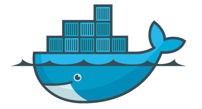
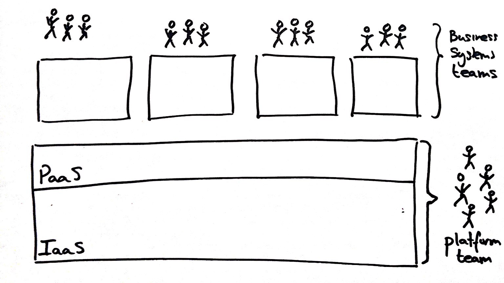
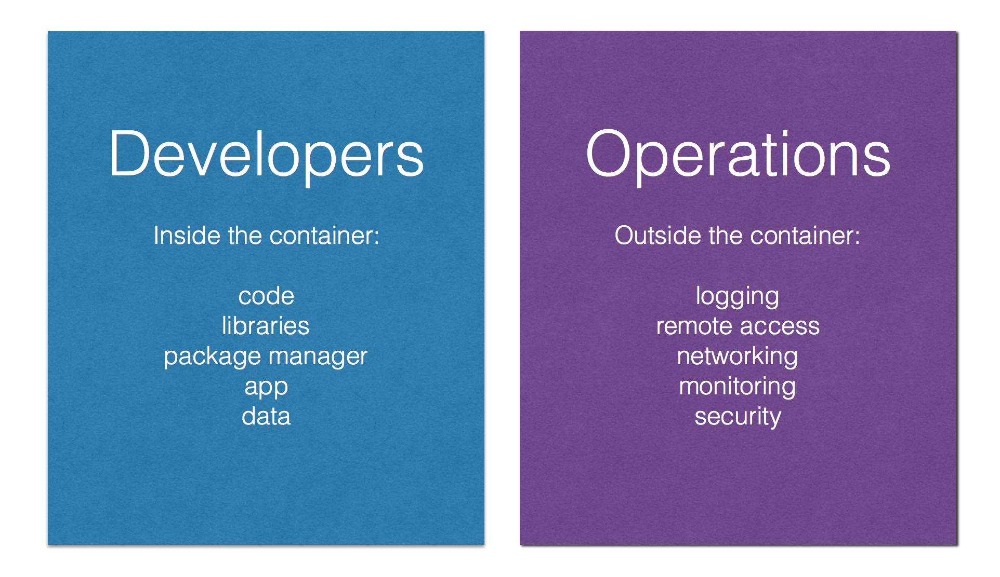

<!-- .slide: data-background="#6B205E" -->
<center><div style="width: 75%; height: auto;"></div></center>

!SLIDE
## Docker - the catalyst of the DevOps Movement
<center>
<p></p>
</center>
    Mark van Holsteijn - <a href="mailto:mvanholsteijn@xebia.com">mvanholsteijn@xebia.com</a><br/>
    Adé Mochtar - <a href="mailto:amochtar@xebia.com">amochtar@xebia.com</a> <br/><br/>
    **Slides** - [http://nauts.io/workshop-docker-introduction](http://nauts.io/workshop-docker-introduction)
</center>


!SUB
## Docker has taken the world by Storm!

- 400.000.000 downloads
- 300.000+ Dockerized applications
- 50.000+ third party projects on Github
- 150.000.000 dollar in funding

!SUB
## Why? It Supports True DevOps!
<center><div style="width: 75%; height: auto;"></div></center>


!SUB
## Separation of Concerns
<center><div style="width: 75%; height: auto;"></div></center>


!SUB
## Docker, the goodies

You get all the goodies of virtual machine per appliance, but without the cost.

- Filesystem isolation
- Resource isolation
- Network isolation

And it is fast!


!SUB
## What is Docker?

- Container management for Linux
- Abstraction for DevOps workflow
- Adds images, image repository and version control to containers

!SUB
## Basic Components
<center><div style="width: 75%; height: auto;"></div></center>


!SUB
## Creating a Docker image
<center><div style="width: 75%; height: auto;"></div></center>

!SUB
## Dockerfile

```
FROM stackbrew/ubuntu
RUN apt-get update && apt-get install -y apache2 && apt-get clean
ENV APACHE_RUN_USER www-data
ENV APACHE_RUN_GROUP www-data
EXPOSE 80
CMD ["/usr/sbin/apache2", "-D", "FOREGROUND"]
```

!SUB
## Docker Images

<div style="position: absolute; right: 0; top:100; width: 25%; height: auto;"></div>
- contain everything needed to run the app
- are portable across daemons
- are built in layers
  - ordered to actions, Add file, Expose port, Run
- stored in a Registry


!SUB
## Docker Hub - Image Registry
<div style="position: absolute; right: 0; top:100; width: 40%; height: auto;"></div>
- Contains Docker images
- Public Registry with official images
- Hosts your own private Registry

!SUB
## Running a container
<center><div style="width: 75%; height: auto;"></div></center>


!SLIDE
## Docker Image Layers

!SUB
## Filesystems
<center>
<p>
		Linux requires two filesystems<br/>

</p>
</center>


!SUB
## Multiple rootfs
<center>
<p>
		Docker supports multiple rootfs<br/>

</p>
</center>


!SUB
## Docker Image
<center>
<p>
		Read-only layers are called images<br/>

</p>
</center>


!SUB
## Stacking images
<center>
<p>
		Images can depend on other images, called parents<br/>

</p>
</center>


!SUB
## Writable containers
<center>
<p>
		On top of images docker creates writable containers<br/>

</p>
</center>


!SLIDE
## Docker commands
<center>
<ul>
<li>Runtime</li>
<li>Information</li>
<li>Filesystem</li>
<li>Images</li>
<li>Repository</li>
</ul>
</center>

!SUB
## Runtime
<center>
<table>
<tbody>
<tr>
<td>ps</td>
<td>List containers</td>
</tr>
<tr>
<td>kill</td>
<td>Kill a running container</td>
</tr>
<tr>
<td>restart</td>
<td>Restart a running container</td>
</tr>
<tr>
<td>rm</td>
<td>Remove a container</td>
</tr>
<tr>
<td>run</td>
<td>Run a command in a new container</td>
</tr>
<tr>
<td>start</td>
<td>Start a stopped container</td>
</tr>
<tr>
<td>stop</td>
<td>Stop a running container</td>
</tr>
<tr>
<td>wait</td>
<td>Block until a container stops, then print its exit code</td>
</tr>
</tbody>
</table>
</center>

!SUB
## Information
<center>
<table>
<tbody>
<tr>
<td>info</td>
<td>Display system-wide information</td>
</tr>
<tr>
<td>inspect</td>
<td>Return low-level information on a container</td>
</tr>
<tr>
<td>logs</td>
<td>Fetch the logs of a container</td>
</tr>
<tr>
<td>port</td>
<td>Lookup the public-facing port which is NAT-ed to PRIVATE_PORT</td>
</tr>
<tr>
<td>attach</td>
<td>Attach to a running container</td>
</tr>
</tbody>
</table>
</center>

!SUB
## Filesystems
<center>
<table>
<tbody>
<tr>
<td>insert</td>
<td>Insert a file in an image</td>
</tr>
<tr>
<td>diff</td>
<td>Inspect changes on a container's filesystem</td>
</tr>
<tr>
<td>commit</td>
<td>Create a new image from a container's changes</td>
</tr>
</tbody>
</table>
</center>

!SUB
## Images
<center>
<table>
<tbody>
<tr>
<td>build</td>
<td>Build a container from a Dockerfile</td>
</tr>
<tr>
<td>import</td>
<td>Create a new filesystem image from the contents of a tarball</td>
</tr>
<tr>
<td>export</td>
<td>Stream the contents of a container as a tar archive</td>
</tr>
<tr>
<td>images</td>
<td>List images</td>
</tr>
<tr>
<td>rmi</td>
<td>Remove an image</td>
</tr>
<tr>
<td>history</td>
<td>Show the history of an image</td>
</tr>
</tbody>
</table>
</center>

!SUB
## Repository
<center>
<table>
<tbody>
<tr>
<td>login</td>
<td>Register or Login to the docker registry server</td>
</tr>
<tr>
<td>pull</td>
<td>Pull an image or a repository from the docker registry server</td>
</tr>
<tr>
<td>push</td>
<td>Push an image or a repository to the docker registry server</td>
</tr>
<tr>
<td>search</td>
<td>Search for an image in the docker index</td>
</tr>
<tr>
<td>tag</td>
<td>Tag an image into a repository</td>
</tr>
</tbody>
</table>
</center>


!SLIDE
## Getting Started

Install your docker-machine on your machine
```
$ docker pull ubuntu
$ docker run ubuntu /bin/echo "hello world"
```


!SLIDE
## Interactive containers


Start /bin/bash in a container
```
$ docker run -t -i ubuntu /bin/bash
root@e97c6f8d0013:/#

# look around all your processes
$ ps -ef

# Checkout your file system
$ ls

# and your network
$ ifconfig

# logout (container is stopped as /bin/bash exits)
$ exit
```


!SUB
## detached containers

Running containers in the background
```
# run -d means detached detach
$ DOCKER_ID=$(docker run -d ubuntu \
bash -c 'while true ; \
	do sleep 1; \
	echo hello world at $(date); \
	done' )
$ echo $DOCKER_ID           # shows id of container
$ docker attach $DOCKER_ID  # attach to stdout of the container
$ docker ps 	      	    # shows all running containers
$ docker stop $DOCKER_ID    # stops specified container
$ docker ps -a 	      	    # shows stopped and running containers
$ docker rm $DOCKER_ID      # removes the container
```

!SLIDE
## versioned file system

```
# Look at an empty filesystem
$ docker run ubuntu /bin/ls /tmp

# Modify the filesystem
$ DOCKER_ID=$(docker run -d ubuntu \
bash -c 'while true ; do \
		date > /tmp/$(date +%Y%m%d%H%M); \
		sleep 60;\
	done')

# See the changes on the filesystem
$ docker diff $DOCKER_ID
# Stop the instance
$ docker stop $DOCKER_ID ; docker rm $DOCKER_ID
# Changes are gone!
$ docker run ubuntu /bin/ls /tmp
```


!SLIDE
## creating a new image


```
# Modify the filesystem
$ DOCKER_ID=$(docker run -d ubuntu \
bash -c 'while true ; do \
	date > /tmp/$(date +%Y%m%d%H%M); \
	sleep 60; \
     done' )

# See the changes on the filesystem and commit
$ docker diff $DOCKER_ID
$ docker commit $DOCKER_ID $USER/mydemo  # name of image $USER/mydemo

# Stop and remove the instance
$ docker stop $DOCKER_ID ; docker rm $DOCKER_ID

# Changes are persisted!
$ docker run $USER/mydemo /bin/ls /tmp
```


!SLIDE
## Dockerfile

<p>Simple format</p>

```
# Comment
INSTRUCTION arguments
```

<p style="clear: both;"><br/>See <a href="https://docs.docker.com/v1.8/reference/builder/">https://docs.docker.com/v1.8/reference/builder/</a></p>

!SUB
## Instructions

<ul>
<li>FROM</li>
<li>MAINTAINER</li>
<li>RUN</li>
<li>CMD</li>
<li>EXPOSE</li>
<li>ENTRYPOINT</li>
<li>ENV</li>
<li>ADD</li>
<li>VOLUME</li>
<li>USER</li>
<li>WORKDIR</li>
</ul>


!SUB
## FROM

<center>
<ul>
<li>Syntax: FROM &lt;image&gt;[:&lt;tag&gt;]</li>
<li>Sets the base image for this image</li>
<li>FROM must be the first non-comment instruction in the Dockerfile.</li>
<li>Can appear multiple times to create multiple images</li>
</ul>
</center>


!SUB
## RUN

<center>
<ul>
<li>Syntax: RUN &lt;command&gt;</li>
<li>Runs the specified command, and commits the result to the image</li>
<li>RUN can be used multiple times</li>
<center>
</ul>
</center>

!SUB
## CMD

<center>
<ul>
<li>Syntax:
<ul>
<li>CMD ["executable","param1","param2"]</li>
<li>CMD ["param1","param2"], use with <code>ENTRYPOINT</li>
<li>CMD command param1 param2</li>
</ul>
</li>
<li>Provides defaults when executing a container</li>
<li>CMD can only be used <em>one</em> time</li>
</ul>
</center>


!SUB
## ENTRYPOINT

<center>
<ul>
<li>Syntax:
<ul>
<li>ENTRYPOINT ["executable","param1","param2"]</li>
<li>ENTRYPOINT command param1 param2</li>
</ul>
</li>
<li>Similar as CMD, but cannot be overwritten with command-line parameters</li>
<li>ENTRYPOINT can only be used <em>one</em> time</li>
</ul>
</center>


!SUB
## EXPOSE

<center>
<ul>
<li>Syntax: EXPOSE &lt;port&gt; [&lt;port&gt; ...]</li>
<li>Defines which ports to expose</li>
</ul>
</center>


!SLIDE
## Lab exercise
<center>
<ul>
<li>Create a tomcat7 image name $USER/tomcat7</li>
<li>push it to the Docker Hub registry</li>
<li>start 5 instances</li>
<li>show they are operational</li>
</ul>
</center>


!SUB
## creating a tomcat image

Create a file 'Dockerfile' in the subdirectory tomcat7 with the following content.

```
FROM    tomcat
```

Build a new image

```
$ cd tomcat7
$ docker build -t $USER/tomcat7 .
```

!SUB
## push to the registry

create an account on hub.docker.com

```
$ docker login
$ docker tag $USER/tomcat7 <docker-hub-name>/tomcat7:v0.1
$ docker push <docker-hub-name>/tomcat7:v0.1
```


!SUB
## running tomcat

```
# Start a tomcat container
$ DOCKER_ID=$(docker run -P –d &lt;docker-hub-name>/tomcat7:v0.1)
# docker inspect show details about the container
$ docker inspect $DOCKER_ID
# Obtain mapped port of port 8080 of the container
$ PORT=$(docker port $DOCKER_ID 8080)
# access tomcat via mapped port
$ curl http://localhost:$PORT
# Obtain ip address of container
$ IPADDRESS=$(docker inspect inspect -f '{{.NetworkSettings.IPAddress}}' $DOCKER_ID)
# http request on image IP address
$ curl http://$IPADDRESS:8080
```


!SUB

## creating a farm of tomcat

```
count=0
TOMCAT_IPS=""
while [ $count -lt 5 ] ; do
  DOCKER_ID=$(docker run -P –d &lt;docker-hub-name>/tomcat7:v0.1)
  IPADDRESS=$(docker inspect -f '{{.NetworkSettings.IPAddress}}' $DOCKER_ID)
  TOMCAT_IPS="$TOMCAT_IPS $IPADDRESS"
  count=$(($count + 1))
done
echo all tomcats : $TOMCAT_IPS
```

!SLIDE
## Create a Docker image using Visual Studio
- Install Docker for Visual Studio
- Create a new .NET Core Web Application
- Add Docker to the Web Project
- Create a docker image from the bin\\docker\\app directory
- Push the image to the registry
- run your application as a container!


!SLIDE
<center><div style="width: 75%; height: auto;"></div></center>
<br />
<center>
[http://nauts.io/workshop-docker-introduction](http://nauts.io/workshop-docker-introduction)
</center>
