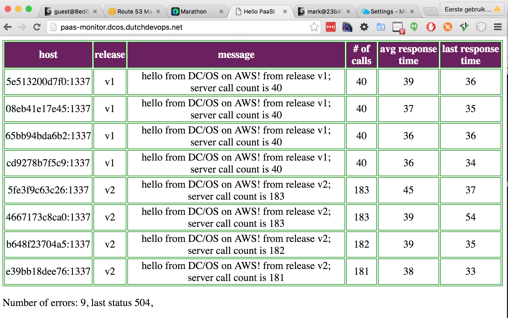

<!-- .slide: data-background="#6B205E" -->
<center><div style="width: 75%; height: auto;"></div></center>

!SLIDE
## Docker Swarm - A complete Docker Container Platform
<center>
<p></p>
</center>
    Mark van Holsteijn - <a href="mailto:mvanholsteijn@xebia.com">mvanholsteijn@xebia.com</a><br/>
    **Slides** - [http://xebia.github.io/workshop-docker-swarm](http://xebia.github.io/workshop-docker-swarm)
</center>


!SUB
## Why? It Supports True DevOps!
<center><div style="width: 75%; height: auto;"></div></center>


!SLIDE
## Docker Swarm Commands
<center>
<ul>
<li>Configuration</li>
<li>Service definition</li>
<li>Network</li>
</ul>
</center>

!SUB
## Swarm configuration

Setting up a Docker Swarm is really easy..

```
  init        Initialize a swarm
  join        Join a swarm as a node and/or manager
  join-token  Manage join tokens
  update      Update the swarm
  leave       Leave a swarm
```

!SUB
## Service definitions

Service

```
  create      Create a new service
  inspect     Display detailed information on one or more services
  ps          List the tasks of a service
  ls          List services
  rm          Remove a service
  scale       Scale one or multiple services
  update      Update a service
```

!SUB
## Network commands
```
  connect     Connect a container to a network
  create      Create a network
  disconnect  Disconnect a container from a network
  inspect     Display detailed information on one or more networks
  ls          List networks
  rm          Remove a network
```

!SLIDE
### The hands-on result
This is your end result today!
<center></center>

!SLIDE
### Hands-on 
- generic instruction, try to solve it yourself
- are you stuck? press 's' and check the presenter notes for typing instructions

### Prerequisites
- Vagrant 1.6.0 or Higher
- VirtualBox 5.0 or Higher
- 4-8 Gb memory free

!SLIDE
## Getting Started

<p></p>

```bash
git clone https://github.com/xebia/workshop-docker-swarm.git
cd workshop-docker-swarm/development-environment
vagrant up
```

!SLIDE
### Initialize the swarm 
<p style="font-size: 75%">
The 'docker swarm init' allows you to initialize a cluster and create your first manager.
** Assignment: **
Login to node-01, initialize your swarm and start node-01 as a swarm manager.
</p>
<p></p>

!NOTE
```
vagrant ssh node-01
docker swarm init --advertise-addr 172.17.8.101
```

!SLIDE
### Add the swarm workers

<p style="font-size: 75%">
The 'docker swarm join' command allows you to add workers to the swarm. The 'docker node' command allows you view all nodes in the Swarm.
** Assignment: **
Add node-02 through node-04 as workers to your Swarm. When you are done, list the nodes in the swarm.
</p>
<p></p>

!NOTE
```
vagrant ssh node-02 -- docker swarm join --token $(vagrant ssh node-01 -- docker swarm join-token -q worker) 172.17.8.101:2377
vagrant ssh node-03 -- docker swarm join --token $(vagrant ssh node-01 -- docker swarm join-token -q worker) 172.17.8.101:2377
vagrant ssh node-04 -- docker swarm join --token $(vagrant ssh node-01 -- docker swarm join-token -q worker) 172.17.8.101:2377
vagrant ssh node-01 -- docker node ls
```

!SLIDE
### Create an overlay network

<p style="font-size: 75%">
The 'docker network create' command allows you to create an overlay network for your application which spans the machines in the swarm.
** Assignment: **
create an overlay network named 'network1'.  When you are done, list all the available networks.
</p>
<p></p>

!NOTE
```
vagrant ssh node-01 -- docker network create --driver overlay network1
vagrant ssh node-01 -- docker network ls
```

!SLIDE
### Create the paas-monitor service


!SUB
### paas-monitor application

A  single page web application that continuously calls a backend service. Each instance of 
the deployed service that responds results in an new row. Instances that have been killed, 
will remain in the table until a refresh. The environment variables 'RELEASE' and 'MESSAGE' 
can be set to mimick new application releases.
<center></center>


!SUB
### create the service

<p style="font-size: 75%">
The 'docker service create' command allows you to create services that are deployed on the Swarm.
** Assignment: **
Add node-02 through node-04 as workers to your Swarm. When you are done, list the nodes in the swarm.
</p>

!NOTE
```
vagrant ssh node-01 -- docker service
vagrant ssh node-03 -- docker swarm join --token $(vagrant ssh node-01 -- docker swarm join-token -q worker) 172.17.8.101:2377
vagrant ssh node-04 -- docker swarm join --token $(vagrant ssh node-01 -- docker swarm join-token -q worker) 172.17.8.101:2377
vagrant ssh node-01 -- docker node ls
```

