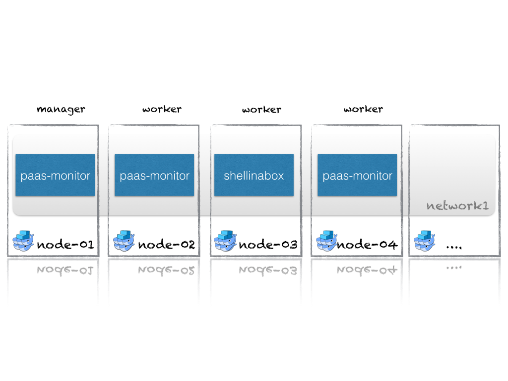

<center><div style="width: 80%; height: auto;"></div></center>

!SLIDE
### Docker Swarm - A complete Docker Container Platform
<center>
<p></p>
</center>
    **Mark van Holsteijn** - <a href="mailto:mvanholsteijn@xebia.com">mvanholsteijn@xebia.com</a><br/>
    **Slides** - [http://xebia.github.io/workshop-docker-swarm](http://xebia.github.io/workshop-docker-swarm)
</center>


!SUB
### Docker Swarm - everything in the box!
Docker Swarm has everything you need in a Docker Container Platform

- Scheduler
- Service Discovery
- Network Load Balancing

all in a single binary!

!SLIDE
## Docker Swarm Commands
- Configuration - docker swarm
- Services - docker service
- Network - docker network

!SUB
## Swarm configuration
Creating swarm clusters.

```
  init        Initialize a swarm
  join        Join a swarm as a node and/or manager
  join-token  Manage join tokens
  update      Update the swarm
  leave       Leave a swarm
```

!SUB
## Service definitions
Defining applications you want to have running.

```
  create      Create a new service
  inspect     Display detailed information on one or more services
  ps          List the tasks of a service
  ls          List services
  rm          Remove a service
  scale       Scale one or multiple services
  update      Update a service
```

!SUB
## Network commands
Creating application specific networks.
```
  connect     Connect a container to a network
  create      Create a network
  disconnect  Disconnect a container from a network
  inspect     Display detailed information on one or more networks
  ls          List networks
  rm          Remove a network
```

!SLIDE
### The hands-on result
<p>This is your end result today!</p>
<center></center>

!SLIDE
### Hands-on
- generic instruction, try to solve it yourself
- are you stuck? press 's' and check the presenter notes for typing instructions

**Prerequisites**
- Docker experience
- Vagrant 1.6.0 or Higher
- VirtualBox 5.0 or Higher
- 4-8 Gb memory free


!SLIDE
### Outlook
- Exploring paas-monitor locally
- Exploring shellinabox locally
- Vagrant setup
- Initializing Swarm
- Create the overlay network
- Deploying services
- Scaling services
- Rolling updates
- Service Discovery
- High Availability

!SLIDE
### Local paas-monitor application

<p style="font-size: 80%">
paas-monitor is a small docker application that allows you to see
the effect of rolling upgrades, scaling, failures etc. the environment variables
'RELEASE' and 'MESSAGE' can be used to mimick new application releases.
<br/>
</p><hr/><p style="font-size: 80%">
** Assignment : **
run the docker image mvanholsteijn/paas-monitor:latest, exposing its port 1337 and point your browser to it.
 what do you see? what happens if you stop the paas-monitor?
</p>
<p>
<center></center>
</p>

!NOTE
- docker-machine create -d virtualbox  dev
- eval $(docker-machine env dev)
- docker run -d --publish :1337:1337 --env "RELEASE=v1" --env "MESSAGE=hello from docker machine." mvanholsteijn/paas-monitor:latest
- open http:$(echo $DOCKER_HOST | cut -d: -f2):1337
- docker stop $(docker ps -ql)

!SLIDE
### Local shellinabox application

<p style="font-size: 80%">
[shellinabox](https://github.com/mvanholsteijn/shellinabox-container) provides a shell with a web interface so you
can safely snoop around on a machine. The environment variables 'SIAB_USER' and 'SIAB_PASSWORD'
allow you to set the username and password with which you can log in.  The environment variable 'SIAB_SSL'  controls
encrytion by the shell.
</p>
<hr/>
<p style="font-size: 80%">
** Assignment : **
run the docker image [mvanholsteijn/shellinabox:latest](https://github.com/mvanholsteijn/shellinabox-container) on your local machine and point your browser to it.
disable SSL and specify a username and password. Login through the web interface and look around.
</p>


!NOTE
- eval $(docker-machine env dev)
- docker run -d --publish :4200:4200 -e SIAB_SSL=false -e SIAB_USER=guest -e SIAB_PASSWORD=password -e SIAB_SUDO=true mvanholsteijn/shellinabox:latest
- open http:$(echo $DOCKER_HOST |cut -d: -f2):4200
- docker stop $(docker ps -ql)

!SLIDE
## Getting Started

<p style="font-size: 80%">
We created a vagrant setup consisting of 4 Ubuntu 16.04 LTS virtual machines on VirtualBox.
</p><hr/><p style="font-size: 80%">
** Assignment: **
Startup the vagrant configuration from https://github.com/xebia/workshop-docker-swarm.git in the directory 'vagrant'

</p>

!NOTE
- git clone https://github.com/xebia/workshop-docker-swarm.git
- cd workshop-docker-swarm/vagrant
- vagrant up


!SLIDE
### Initialize the swarm
<p style="font-size: 80%">
The 'docker swarm init' allows you to initialize a cluster and create your first manager.
</p><hr/><p style="font-size: 80%">
** Assignment: **
Login to node-01, initialize your swarm and start node-01 as a swarm manager.


</p>

!NOTE
- vagrant ssh node-01
- docker swarm init --advertise-addr 172.17.8.101

!SLIDE
### Add the swarm workers
<p style="font-size: 80%">
The 'docker swarm join' command allows you to add workers to the swarm. The 'docker node' command allows you view all nodes in the Swarm.
</p><hr/><p style="font-size: 80%">
** Assignment: **
Add node-02 through node-04 as workers to your Swarm. When you are done, list the nodes in the swarm.


</p>

!NOTE
- vagrant ssh node-02 -- docker swarm join --token $(vagrant ssh node-01 -- docker swarm join-token -q worker) 172.17.8.101:2377
- vagrant ssh node-03 -- docker swarm join --token $(vagrant ssh node-01 -- docker swarm join-token -q worker) 172.17.8.101:2377
- vagrant ssh node-04 -- docker swarm join --token $(vagrant ssh node-01 -- docker swarm join-token -q worker) 172.17.8.101:2377
- vagrant ssh node-01 -- docker node ls

!SLIDE
### Create an overlay network

<p style="font-size: 80%">
The 'docker network create' command allows you to create an overlay network for your application which spans the machines in the swarm.
</p><hr/>
<p style="font-size: 80%">
** Assignment: **
create an overlay network named 'network1'.  When you are done, list all the available networks.

</p>

!NOTE
- vagrant ssh node-01 -- docker network create --driver overlay network1
- vagrant ssh node-01 -- docker network ls

!SLIDE
### Create the paas-monitor service
<p style="font-size: 80%">
The 'docker service create' command allows you to create services that are deployed on the Swarm.  'docker service ps' shows
all running instances.

</p><hr/><p style="font-size: 80%">
** Assignment: **
Create the service paas-monitor for the docker application mvanholsteijn/paas-monitor:latest on the network 'network1'. Expose
port 1337 as port 80. Start with 1 instance. Open the browser on http://172.17.8.101.
one which node is the paas-monitor running?


</p>


!NOTE
- vagrant ssh node-01 -- docker service create --name paas-monitor --env RELEASE=v1 --replicas 1 --network network1 -p :80:1337/tcp  mvanholsteijn/paas-monitor:latest
- open http://172.17.8.101
- vagrant ssh node-01 -- docker service ps paas-monitor

!SLIDE
### Scaling the paas-monitor
<p style="font-size: 80%">
The 'docker service scale' allows you to scale the number of services that are deployed on the Swarm.  

</p><hr/><p style="font-size: 80%">
** Assignment: **
open your browser on http://172.17.8.101 and scale the paas-monitor to 3 instances. What is happening?
one which nodes is the paas-monitor running now?


</p>


!NOTE
- vagrant ssh node-01 -- docker service scale paas-monitor=3
- open http://172.17.8.101
- vagrant ssh node-01 -- docker service ps paas-monitor


!SLIDE
### Rolling updates
<p style="font-size: 80%">
The 'docker service update' allows you to update the service definition which will be deployed in a rolling fashion.

</p><hr/><p style="font-size: 80%">
** Assignment: **
open your browser on http://172.17.8.101 and change the environment variable RELEASE to v2. What is happening?


</p>


!NOTE
- open http://172.17.8.101
- vagrant ssh node-01 -- docker service update --env-add RELEASE=v2 paas-monitor

!SLIDE
### Service Discovery
<p style="font-size: 80%">
Swarm creates a virtual IP address for every deployed service so that the service can be reached independent of their physical location.
</p><hr/><p style="font-size: 80%">
** Assignment: **
Create the service shellinabox for the docker application mvanholsteijn/shellinabox:latest on the network 'network1'. Expose
port 4200 as port 4200. Login on http://172.17.8.101:4200. What is the ip address of the paas-monitor service? And for the shellinabox?


</p>


!NOTE
- vagrant ssh node-01 -- docker service create --name shellinabox --network network1 -p :4200:4200 -e SIAB_SSL=false -e SIAB_USER=guest -e SIAB_PASSWORD=password -e SIAB_SUDO=true mvanholsteijn/shellinabox:latest
- open http://172.17.8.101:4200
- login with guest/password
- dig +short paas-monitor
- dig +short shellinabox

!SLIDE
### High Availability
<p style="font-size: 80%">
Swarm maintains the number of specified replicas of the application in the swarm.
</p><hr/><p style="font-size: 80%">
** Assignment: **
Stop one of the paas-monitor instances. What do you see happen?


</p>


!NOTE
- open http://172.17.8.101
- vagrant ssh node-01 -- docker service ps paas-monitor
- curl http://172.17.8.101/stop
- vagrant ssh node-01 -- docker service ps paas-monitor

!SLIDE
<center><div style="width: 80%; height: auto;"></div></center>
